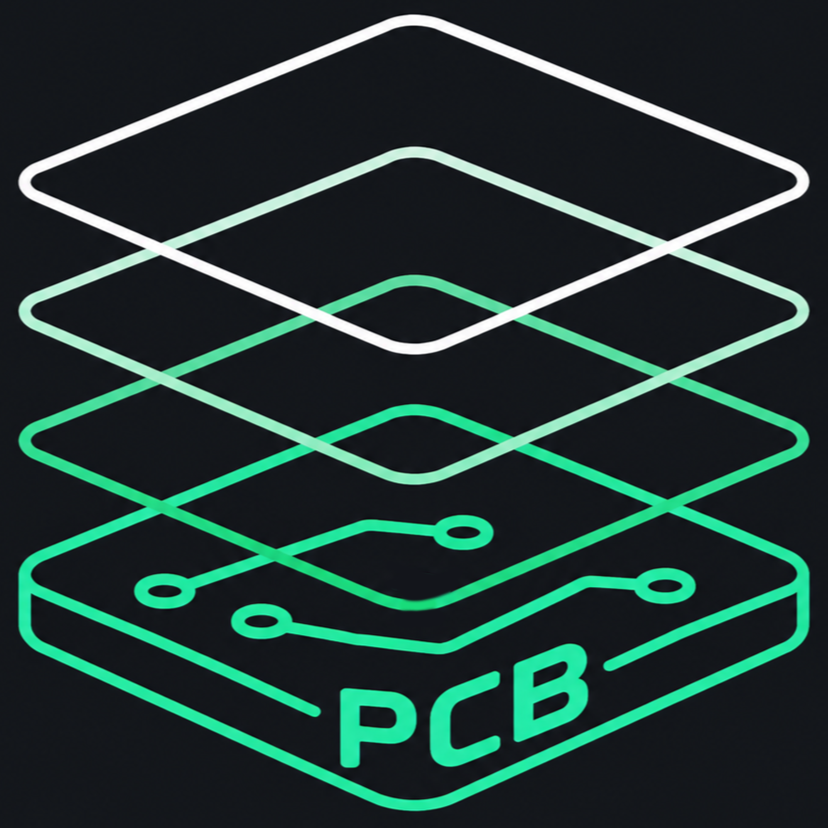

    

<h1 align="center">PCB_lightgraph</h1>

    
    
     
    
    

    
    

 

PCB_lightgraph是一个将 2D 插画 一键转换为可制造 PCB 分层图纸的桌面工具 
实时预览，图片无需预处理。

## 亮点功能

1. **多层自动拆分**：自动拆为铜层/阻焊/丝印/背透光四层，实现**单面5色+透光n色**
2. **灯光设计**：自动（重心建议）或手动布灯，灯光范围实时预览，散射半径与不透明度可调
3. **边缘处理双模式**：边缘增强（拉普拉斯）/ 描边（Canny），共享阈值统一调参
4. **工程文件**：一键保存/打开 `*.pcblg` 工程包
5. **图像实时联动**：`File -> 画图实时编辑`，画图 `Ctrl+S` 后自动重载

点击查看界面概览

### 一键自动金色沉金勾线，单面5色，随意调节，实时预览，图片可无需预处理。(此示例无预处理)

## 快速上手

1. 打开程序，`File -> 导入图片`（无需预处理）
2. 调整基础参数（工艺、阻焊色、阈值）
3. 视需求开启边缘操作，选择描边或增强
4. （可选）使用自动/手动布灯预览效果
5. `File -> 导出图纸`，或 `保存工程 (.pcblg)` 中途保存

## 技术要点

### 1. 图像分层核心
基于阈值与颜色/亮度规则，将输入图像自动拆分为 PCB 制造所需层，统一流程输出四层图。

### 2. 边缘增强与描边
- 边缘增强：使用拉普拉斯算子强化轮廓与细节边界
- 描边（Canny Stroke）：稳定的线条提取，适合插画轮廓
- 自动反色范围：按局部环境决定边缘色，减轻明暗背景对比不足

### 3. 高斯预滤波
可在边缘处理前降噪去杂点，可开关，提升边缘处理稳定性。

### 4. Douglas-Peucker 路径抽稀（实验性）
对轮廓路径抽稀简化、减少冗余点，支持容忍度与线宽参数。

### 5. 自动布灯建议
基于图像分布与权重给出布灯候选点，支持手动覆盖调整。

## 性能、兼容性与优化处理

- 边缘计算缓存化：避免重复计算，边缘模式切换与反复预览响应迅速
- 大图高稳定导入：像素上限预判与自动缩放，降低崩溃风险
- 图片格式强兼容：文件头检测，处理后缀与真实编码不一致的图片

## 构建

- 环境：Qt 6.5.3，Windows (MinGW/MSVC 均可)
- 步骤：Qt Creator 打开 `PCB_lightgraph.pro`，选择 Kit，构建运行

## 相关视频

- [PCB艺术画制作 速通【教程】 v1.1.1](https://www.bilibili.com/video/BV1bJRbBeEW9/)
- [从零开始的二次元电路板艺术画设计 v1.2.0](https://www.bilibili.com/video/BV1CQjz6ZELZ/)
- [PCB灯光画以战双帕弥什露西亚为例](https://www.bilibili.com/video/BV1EgAaz2Exx/)

## 感谢

**作者**： 
[@芙ling痛恨数学分析](https://space.bilibili.com/549252923) 独立开发并持续维护本软件
 
**感谢**：  
[@御坂10297号](https://space.bilibili.com/454466365) 制作教学视频并分享项目  
[@Laplac_heroin](https://space.bilibili.com/3461564136950176) 优化软件使用体验

用户交流QQ群：[点击加入群聊](https://qm.qq.com/q/w8af77CnDi)

### 如果觉得软件对你有帮助，帮忙点个 Star 吧！~（网页最上方右上角的小星星），这就是对我们最大的支持了！

## 许可证

本项目代码采用 [MIT License](https://opensource.org/licenses/MIT) 开源，您可以自由使用、修改、分发，仅需保留版权声明与许可证文本。

> 代码本身许可宽松，但本软件产出的图纸与成品画面属于二次创作范畴，其合规性取决于您所使用的原始素材，与代码许可无关。

---

### 声明

本软件是一款将 2D 插画转换为 PCB 分层图纸的开源工具（以下简称"本工具"），主要面向学习、研究与个人创作。

1. **素材版权由使用者负责**：本工具不会为输入图像做版权审查。若您使用他人的原创作品（插画、角色形象、图片等）进行制作，请确保已获得相应授权；因素材侵权产生的纠纷与责任由使用者自行承担，与作者及本工具无关。
2. **肖像与隐私**：请勿使用本工具处理涉及他人肖像、隐私或敏感内容的图像。
3. **商用免责**：若有商家/商贩使用本工具进行 PCB 周边产品的生产与销售，由此产生的产品质量、商业模式、版权纠纷及其他一切问题与后果，均与作者及本工具无关，作者不承担任何责任。
4. **按现状提供（AS-IS）**：本工具按现状提供，不附带任何明示或暗示的担保，作者不对其适用性、可靠性或特定用途作出任何保证。
5. 使用本工具即视为已阅读并同意以上内容。
